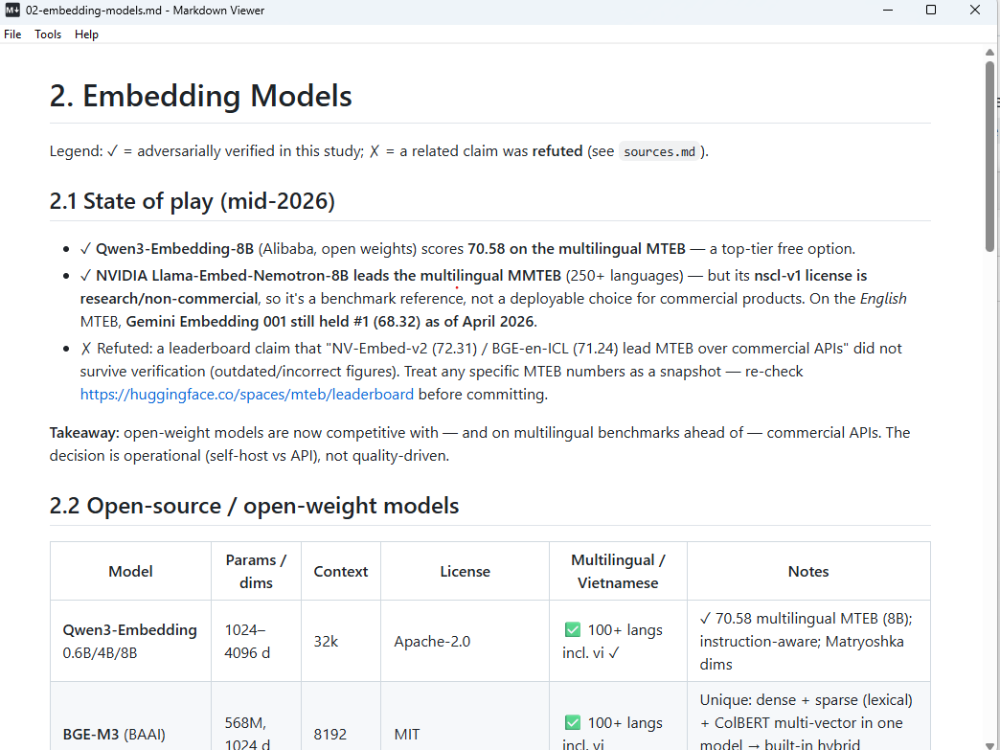
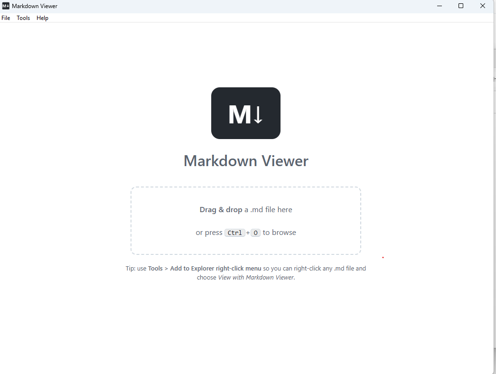
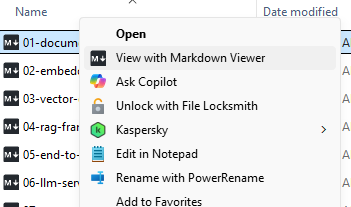

# Markdown Viewer

A small, fast Markdown viewer for Windows: a single native exe (Win32, C++17)
rendering with **markdown-it + highlight.js inside WebView2** (Edge/Chromium).
No admin rights needed — run the portable exe directly, or use the per-user
installer.

> **A note from the owner:** this repo was mostly written by AI, with quick
> review and testing by me. It's a simple tool for quickly viewing `.md` files
> on Windows — thanks for checking it out!

## Screenshots

GitHub-style rendering with tables, task lists, and syntax highlighting:



Welcome screen — drag & drop a file or press `Ctrl+O`:



Explorer right-click integration:



## Download

From the [latest release](https://github.com/dim0147/MarkdownViewer/releases/latest):

- `MarkdownViewer-Setup-<version>.exe` — per-user installer (recommended)
- `MarkdownViewer-Portable-<version>.zip` — just the exe, no install; unzip
  and run

Or build from source — see [Building](#building).

## Installing

The installer is per-user: it installs to
`%LOCALAPPDATA%\Programs\Markdown Viewer` — no administrator rights — adds a
Start menu entry, and (optionally, on by default) the Explorer right-click
menu and a desktop icon.

**Uninstalling** (Settings → Apps, or the uninstaller in the install folder)
removes *everything*: the program files, the Explorer context-menu registry
entries, and the app's caches and settings
(`%LOCALAPPDATA%\MarkdownViewer`, `%APPDATA%\MarkdownViewer`). Nothing is
left behind.

Alternatively, skip the installer entirely: `MarkdownViewer.exe` is fully
portable.

## Features

- **GitHub-style rendering** (CommonMark + GFM via markdown-it): headings,
  lists, task lists, tables with alignment, fenced code blocks with **syntax
  highlighting**, blockquotes, links, images, strikethrough, autolinks
- **Light / dark theme** — follows Windows automatically, or force via settings
- **Explorer integration** — right-click any `.md` file → *View with Markdown
  Viewer* (on Windows 11 it may be under *Show more options*)
- **Drag & drop** a `.md` file anywhere on the window; `Ctrl+O` to browse;
  or pass a file on the command line
- `F5` reloads the file *and* your settings (handy while editing)
- Clicking a relative `.md` link opens it in the viewer; external links open
  in your default browser
- **Safe by design** — raw HTML in documents is escaped (backed by a strict
  CSP), document links can't escape the document's folder, and the viewer
  never launches other local files
- Handles UTF-8 / UTF-16 / ANSI files; relative images resolve against the
  document's folder

## Settings

*Tools → Settings (config.json)* opens `%APPDATA%\MarkdownViewer\config.json`:

```json
{
  "theme": "auto",          // "auto" | "light" | "dark"
  "maxWidth": 920,          // content width in px, 0 = full width
  "fontSize": 16,
  "syntaxHighlight": true,
  "linkify": true,          // turn bare URLs into links
  "typographer": false      // smart quotes and dashes
}
```

Press `F5` in the viewer to apply changes.

## Building

Requires Visual Studio (Community is fine) with the C++ workload:

```bat
build.bat
```

or open `MarkdownViewer.sln`. The first build downloads the pinned WebView2
SDK into `third_party/` and generates the app icon automatically.

Running requires the **WebView2 Runtime**, preinstalled on Windows 11 and
recent Windows 10.

### Building the installer

Requires [Inno Setup](https://jrsoftware.org/isinfo.php) (7.x):

```bat
build.bat
ISCC.exe installer\MarkdownViewer.iss
```

Output: `installer\output\MarkdownViewer-Setup-<version>.exe`. The version is
read from the exe's version resource (`res/app.rc`).

## Explorer right-click menu

| Action  | How |
|---------|-----|
| Install | *Tools > Add to Explorer right-click menu* (or `MarkdownViewer.exe --register`) |
| Remove  | *Tools > Remove from Explorer right-click menu* (or `MarkdownViewer.exe --unregister`) |

Registration is per-user (`HKCU`), so no administrator rights are needed.
It covers `.md`, `.markdown`, `.mdown`, and `.mkd`.

> **Note:** if you move `MarkdownViewer.exe` to a different folder, run
> *Tools > Add to Explorer right-click menu* again so the registered path is updated.

## Project layout

```
src/          C++ shell: window, WebView2 host, file IO, registry (see CLAUDE.md)
assets/       web renderer: index.html, app.js (markdown-it), app.css, vendor libs
res/          icon, manifest, version info; embeds assets/ into the exe
tools/        WebView2 SDK fetcher, icon generator
installer/    Inno Setup script → per-user installer (output/ is gitignored)
test/         sample.md rendering smoke test; manual/ link-behavior tests
CLAUDE.md     architecture guide for maintainers (start here)
```
