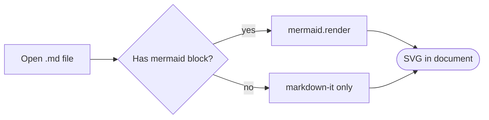

# Markdown Viewer Test

This file exercises **bold**, *italic*, ***bold italic***, ~~strikethrough~~,
`inline code`, and a [link](https://example.com "Example"). Autolink: https://github.com

## Lists

1. First ordered item
2. Second item
   - Nested bullet
   - Another nested bullet
3. Third item

- [x] Completed task
- [ ] Pending task

## Code

```cpp
#include <iostream>
int main() {
    std::cout << "Hello, Markdown!" << std::endl;  // <html> chars & escaped
    return 0;
}
```

## Table

| Feature      | Status | Notes          |
|:-------------|:------:|---------------:|
| Headings     |   OK   | h1 through h6  |
| Code blocks  |   OK   | fenced + indented |
| Tables       |   OK   | with alignment |

## Quote

> Markdown is a lightweight markup language.
> — *John Gruber*
>
> > Nested quotes also work.

## Mermaid diagram



## Math

Inline math renders mid-sentence: Einstein's $E = mc^2$ stays on the line.

A display equation on its own:

$$\int_0^\infty e^{-x}\,dx = 1$$

A fenced ` ```math ` block (also accepts ` ```latex `):

```math
\sum_{n=1}^{\infty} \frac{1}{n^2} = \frac{\pi^2}{6}
```

## Collapsed section

Raw HTML now renders (markdown-it html:true + DOMPurify sanitizing the output):

<details>
<summary>Click to expand</summary>

Hidden **markdown** content here, including a list:
- item one
- item two
</details>

Inline HTML also works: press <kbd>Ctrl</kbd>+<kbd>O</kbd>, and H<sub>2</sub>O / E=mc<sup>2</sup>.

---

Setext Heading
==============

Final paragraph with a hard break here.
And the second line after a break.
